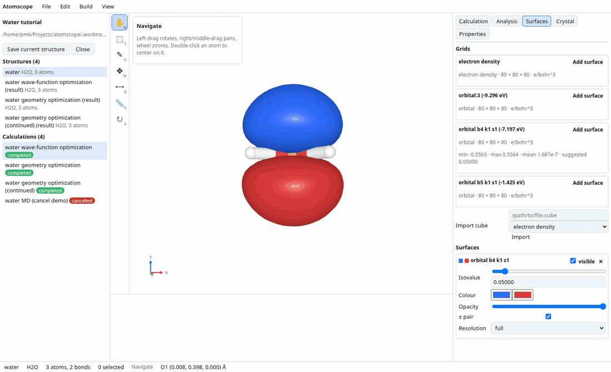
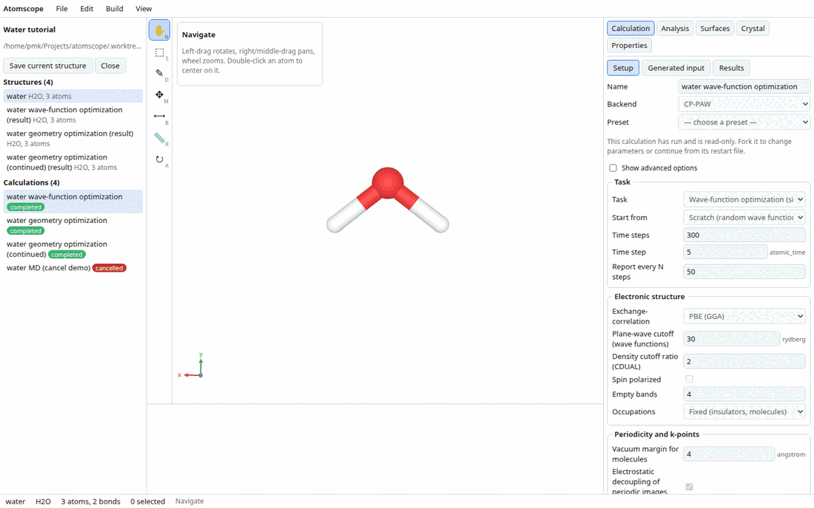
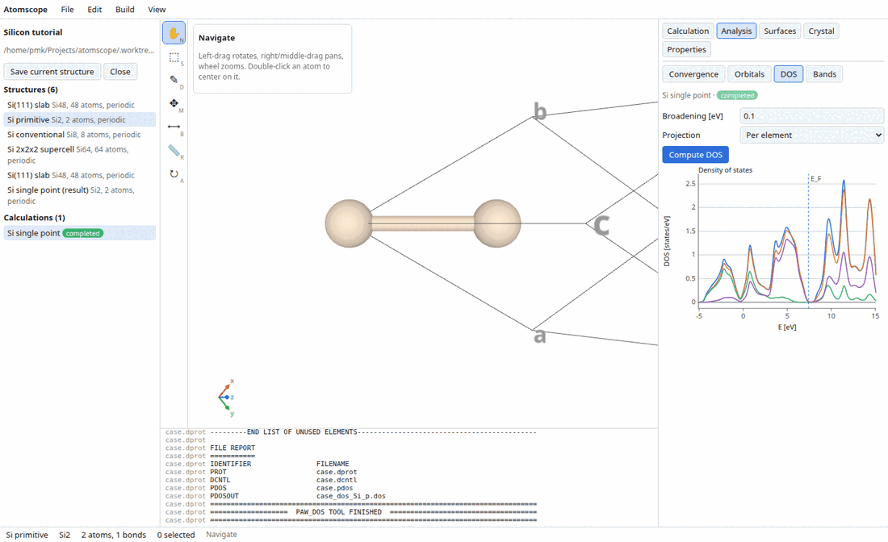
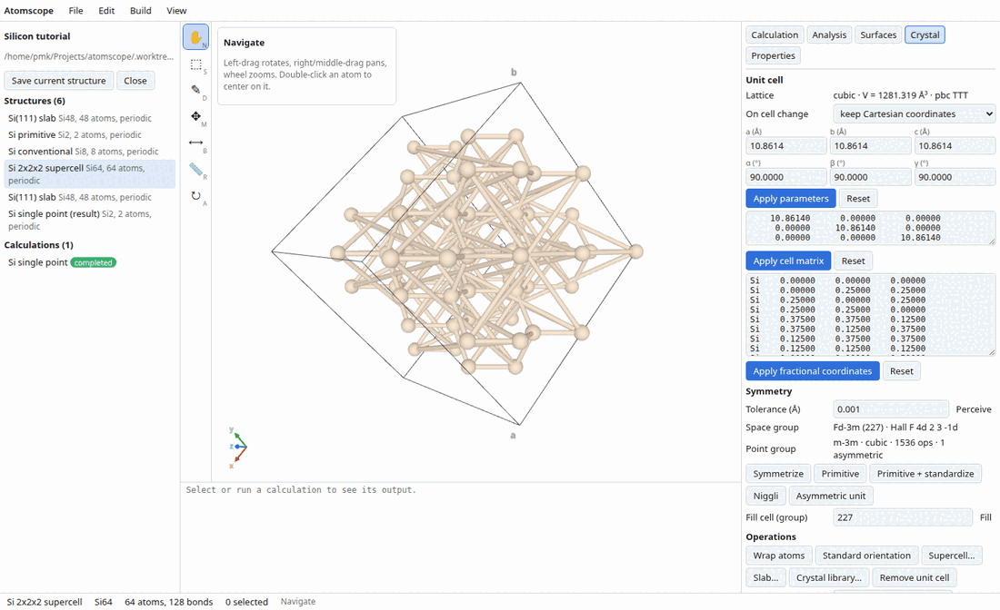

# Atomscope user guide

Atomscope is a molecular modelling, computational-chemistry and visualization
environment. You build or import a structure, look at it, set up a calculation
through a form the backend itself describes, run it locally, and analyse the
result — all inside a project directory you own.

This guide describes the application **as it behaves today**. Everything in it
was checked against a running instance (backend `0.1.0`, ASE 3.26.0, CP-PAW
`aa467ef873`). Where a feature exists only in the HTTP API and has no user
interface yet, that is stated explicitly.

Contents:

1. [Installation and first start](#1-installation-and-first-start)
2. [The application window](#2-the-application-window)
3. [Projects](#3-projects)
4. [Building and editing structures](#4-building-and-editing-structures)
5. [Importing and exporting files](#5-importing-and-exporting-files)
6. [Visualization](#6-visualization)
7. [Calculations](#7-calculations)
8. [Analysis](#8-analysis)
9. [Keyboard shortcuts](#9-keyboard-shortcuts)
10. [Limits and known problems](#10-limits-and-known-problems)

---

## 1. Installation and first start

### 1.1 What you need

| Requirement | Notes |
|---|---|
| Python 3.12 (`>=3.12,<3.13`) | the backend pins this range |
| [`uv`](https://docs.astral.sh/uv/) | creates and manages the backend virtual environment |
| `pnpm` (v10) and Node 22 | frontend build and dev server |
| A WebGL2 browser | the frontend is a normal web page; there is no desktop shell yet |
| **CP-PAW** (optional) | only needed for the DFT backend; everything else works without it |

Every Python and JavaScript dependency is installed from wheels/npm — nothing
is compiled by hand. Open Babel comes in through `openbabel-wheel`, RDKit
through the `rdkit` wheel, so no conda environment is required.

### 1.2 Bootstrap

```bash
git clone <repository> atomscope
cd atomscope
source env.sh          # keeps every cache inside the checkout
./scripts/bootstrap.sh
```

`env.sh` sets `UV_CACHE_DIR`, `UV_PROJECT_ENVIRONMENT`, `npm_config_cache`,
`PLAYWRIGHT_BROWSERS_PATH` and `ATOMSCOPE_DATA_DIR` to directories inside the
checkout. That is a deliberate rule of this project: **nothing installs
globally**. `scripts/bootstrap.sh` runs `uv sync --extra dev` for the backend,
`pnpm install --frozen-lockfile` for the frontend, downloads a project-local
Playwright Chromium (optional; failure is tolerated) and finally reports
whether CP-PAW was found.

`make setup` does the first two steps only.

### 1.3 Starting the application

Two processes, in two terminals:

```bash
make dev-backend     # FastAPI on http://127.0.0.1:8765
make dev-frontend    # Vite dev server on http://127.0.0.1:5173
```

Then open <http://127.0.0.1:5173>. The Vite dev server proxies `/api` (HTTP and
WebSocket) to the backend, so the browser only ever talks to one origin.

Both bind to the loopback interface only. The backend's own launcher refuses
any other host (`python -m atomscope.api.server --host` accepts only
`127.0.0.1` and `localhost`), and there is **no authentication** — do not
expose the port.

To run a second instance next to a first one, override the port and tell Vite
where the backend is:

```bash
cd backend && PYTHONPATH=$PWD/src python -m atomscope.api.server --port 8770
cd frontend && ATOMSCOPE_API_URL=http://127.0.0.1:8770 pnpm dev --port 5178
```

Check that the backend is alive:

```console
$ curl -s http://127.0.0.1:8765/api/health
{"status":"ok","version":"0.1.0","ase_version":"3.26.0"}
```

### 1.4 What needs CP-PAW and what does not

`GET /api/backends` reports, per backend, whether its executables were found.
On a machine without CP-PAW the `cppaw` entry simply says it is unavailable and
the Calculation panel greys it out — nothing else changes.

| Works with no external program | Needs CP-PAW |
|---|---|
| Building, editing, measuring, all display options | DFT total energies, forces, relaxation, MD |
| SMILES, all file import/export, the crystal and fragment libraries | Electron-density and orbital cubes |
| Crystallography (spglib): symmetry, supercells, slabs, Niggli, primitive | Density of states / projected DOS |
| Open Babel force fields (MMFF94, MMFF94s, UFF, GAFF, Ghemical): energy, optimization, conformer search | Band structures |
| ASE built-in calculators (EMT, Lennard-Jones, Morse) with BFGS and Langevin MD | |
| Quantum-chemistry **input generation** (ORCA, Gaussian, NWChem, GAMESS-US, GAMESS-UK, Molpro, Q-Chem, Psi4, MOPAC, Quantum ESPRESSO, ABINIT) | |

CP-PAW is located by looking, in order, at `$ATOMSCOPE_CPPAW_DIR/bin/fast`,
`$PAWDIR/bin/fast`, `~/cp-paw/bin/fast` and then `PATH`. Set
`ATOMSCOPE_CPPAW_DIR` if your installation is elsewhere. The plugin also
probes the runtime once and, if the binaries fail because the system
`libgfortran` is newer than the one they were built against, transparently
retries with a compatible `libgfortran` found under `~/miniconda3/pkgs`
(override with `ATOMSCOPE_CPPAW_LIBRARY_PATH`).

---

## 2. The application window



```
┌───────────────────────────────────────────────────────────────────────────┐
│ Atomscope  File Edit Select Build Extensions View Help          menu bar  │
├──────────────┬──┬─────────────────────────────────┬───────────────────────┤
│              │T │                                 │  Calculation          │
│  Project     │o │                                 │  Analysis             │
│  panel       │o │        Viewport                 │  Surfaces             │
│              │l │        (WebGL + overlay)        │  Crystal              │
│  structures  │b │                                 │  Properties           │
│  calculations│a │   ┌ tool settings ┐ (floating)   │                       │
│              │r │                                 │      right dock       │
│              │  ├─────────────────────────────────┤                       │
│              │  │ trajectory player (when loaded) │                       │
│              │  ├─────────────────────────────────┤                       │
│              │  │ job console                     │                       │
├──────────────┴──┴─────────────────────────────────┴───────────────────────┤
│ name │ formula │ atoms, bonds │ selected │ tool │ measurement │ hover      │
└───────────────────────────────────────────────────────────────────────────┘
```

**Menu bar** — `File`, `Edit`, `Select`, `Build`, `Extensions`, `Settings`, `View`,
`Help`.
`Settings ▸ Preferences…` holds the settings that are about the program rather
than the structure: rendering `Quality` (low / automatic by size / high
tessellation), `Depth cueing` (distant atoms fade into the background),
projection, background — the white/grey/black presets, or `Custom…` for a
colour well that takes any colour, which depth cueing then fades towards — and
the list of calculation backends with what each one found on this machine. They are stored **with the open project**, not globally,
and a backend is enabled by installing it, not from the dialog.
`Settings ▸ Plugin manager…` lists everything the application registers —
display types, tools, extensions, colours and panels — with a switch and a
description each. Switching one off takes effect at once: the tool leaves the
toolbar (and its keyboard shortcut with it), the display type leaves the view,
the extension leaves its menu, the colour scheme leaves the `Colour by` list and
the panel loses its dock tab, whichever tab was open falling back to the first.
Two cannot be switched off, because everything else falls back to them: the
navigate tool and the element colour scheme. Which are off is remembered in this
browser, like the tool settings.
`Edit` holds undo/redo, cut/copy/paste/clear and the Cartesian editor; `Select`
holds the selection commands (all, none, invert, by element, by residue, solvent,
by SMARTS); `Help`
names the guides, the tutorials and the shortcuts. See the
[shortcut table](#9-keyboard-shortcuts) for the accelerators.

**Project panel** (left) — open/create a project, and the lists
`Structures (n)` and `Calculations (n)`. Clicking a structure loads it into
the viewport; clicking a calculation selects it, which is what drives the
Calculation, Analysis and Surfaces panels and the job console.

**Tool bar** (vertical strip) — the seven editor tools; each button shows an
icon and its shortcut letter.

**Viewport** — the Three.js scene. An SVG overlay on top of it draws
tool feedback (rubber band, measurement markers and labels, bond labels);
nothing tool-related is drawn inside the 3-D scene.

**Tool settings** — a floating panel over the viewport showing the options of
the active tool.

**Right dock** — seven tabs, all kept mounted so form state survives switching:

| Tab | Purpose |
|---|---|
| `Calculation` | choose a backend, fill in the parameter form, preview the generated input, run, read results |
| `Analysis` | convergence charts, orbital browser, DOS, band structure |
| `Spectra` | vibrational, NMR, UV-Vis and CD spectra, with mode animation |
| `Surfaces` | volumetric grids and the isosurfaces made from them |
| `Display` | every display layer and its settings (see [§6](#6-visualization)) |
| `Crystal` | unit cell, symmetry, cell operations, space groups |
| `Properties` | structure, selected-atom and bond properties, editable |

**Trajectory player** — appears between the viewport and the job console only
when a trajectory is loaded.

**Job console** — the streamed output of the selected calculation's job and of
its post-processing jobs, each line prefixed with its stream name. For CP-PAW
this is the driver log plus a live tail of `case.prot`.

**Status bar** — structure name, formula, atom/bond counts, selection size,
active tool, the measurement readout (Measure tool only), the hovered atom with
its coordinates, and error messages (which clear themselves after 8 s).

---

## 3. Projects

A project is a plain directory. Everything needed to reopen and continue work
is inside it; nothing lives in browser storage.

```
<project>/
  project.json                        manifest: id, name, format_version, timestamps,
                                      structure/calculation/dataset ids, notes, view settings
  structures/<id>.json                structure documents
  datasets/<id>.json + <id>.f32       imported volumetric grids (metadata + binary sidecar)
  presets/                            created, currently unused
  calculations/<calc-id>/
    calculation.json                  backend id, full parameter values, status, job record
    input/                            structure.json, values.json and the generated input files
    work/                             the working directory of the run: raw program output,
                                      job.json, driver.log/driver.err (CP-PAW), case.prot, ...
    results/                          results.json (the parsed ResultBundle)
                                      + <grid-id>.f32 sidecars for cubes
```

JSON is written with sorted keys and two-space indentation, so a project
directory diffs and version-controls cleanly. Binary sidecars are
little-endian float32 in C order. Grid references are relative to the project
root, so a project can be zipped and moved.

**Opening and creating.** In the Project panel, type an absolute directory path
on the machine running the backend and press `Open` or `Create`. `Create`
requires the directory to be missing or empty and names the project after the
last path segment. `Close` detaches it.

**Only one project is open at a time**, per backend process. The panel offers
`Open`/`Create` only when none is open, so close the current one first;
`Close` also clears the calculation list and drops loaded grids.

**What is persisted.** Structures (explicitly, with `Save current structure`),
calculations with their full merged parameter values and job record, parsed
results, volumetric grids, and the view settings (representation, projection,
hydrogen visibility, background, layer toggles), which are saved back to
`project.json` about half a second after you change them.

**What is not persisted.** The undo history; trajectories imported through
`File ▸ Import trajectory…` (calculation trajectories *are* stored, inside
`results.json`); the current selection and camera.

> `Save current structure` writes under the id of the document currently in
> the viewport. Crystal operations (supercell, slab, primitive cell, …) keep
> that id, so saving after such an edit **overwrites** the entry you started
> from rather than adding a new one. To keep both, save the derived structure
> and then re-insert the original from the crystal library (a library insert
> gets a fresh id), or export the intermediate to a file.

---

## 4. Building and editing structures

The tool bar holds eight tools. Only `Navigate` and `Auto-rotate` let the mouse
drive the camera; in every other tool a drag belongs to the tool. The mouse
wheel always zooms, and the browser context menu is suppressed over the canvas.

| Tool | Key | What the mouse does |
|---|---|---|
| **Navigate** | `N` | left-drag orbits about the pivot; right-drag, middle-drag and `Shift`+left-drag pan; wheel zooms; double-click an atom to make it the pivot, double-click empty space to fit the view |
| **Select** | `S` | click an atom to select it, click a bond to select both its atoms, click empty space to clear; drag a rubber band; `Shift` adds, `Ctrl`/`Cmd` toggles; double-click selects the whole connected fragment; right-click over nothing clears |
| **Draw** | `D` | click empty space adds an atom of the current element; click an existing atom changes its element; click a bond cycles its order 1→2→3→1; drag from an atom grows a new bonded atom, or bonds to the atom you release over; right-click deletes an atom (with its hydrogens) or a bond; keys `1`/`2`/`3` set the order for new bonds |
| **Manipulate** | `M` | left-drag moves the selection (or the atom under the cursor) in the view plane; `Shift`+left-drag moves along the view axis; right-drag rotates about the centroid |
| **Bond-centric** | `B` | click a bond to select it; left-drag changes its length (the smaller fragment moves, minimum 0.3 Å); right-drag rotates that fragment about the bond axis; left-drag an atom next to the bond to change the angle it makes with it |
| **Measure** | `R` | click up to four atoms — two give a distance, three an angle, four a dihedral; click a marked atom to unmark it; right-click resets |
| **Auto-optimize** | `O` | runs the force field continuously; left-drag an atom and it is pinned where you hold it while the rest of the molecule relaxes around it |
| **Auto-rotate** | `A` | spins the view at the configured x/y/z speeds; any click in the viewport stops it |

Every drag is a single undo step: the tool previews the change live and commits
once on pointer-up, with a descriptive label that the `Edit` menu shows
(`Undo Add C`, `Redo Rotate 3 atoms`, …). The undo stack holds 200 entries.
Loading a document — `File ▸ New`, `File ▸ Open…`, clicking a structure in the
project panel, importing a trajectory, `Load final structure` — **clears the
undo history**.

### 4.1 Tool settings

Tool settings are remembered between sessions, in this browser: the element the
draw tool puts down, the selection mode, the auto-rotate speeds, the optimizer's
force field, algorithm and steps, which tool was active, and which dock tab was
open. They are *preferences*, so they follow you into the next project rather
than being stored with one — unlike the view settings (representation, colours,
which layers are on), which describe a particular structure and are saved with
the project. Nothing that points at the open document is kept: a rubber band, a
selected bond, a half-finished measurement and a running optimization all start
clean, since restoring them into another structure would point at atoms that
are not there.

* **Draw** — an element field (type a symbol, or press `…` for a periodic
  table of Z = 1…118), a bond-order selector (`Single`/`Double`/`Triple`), and
  an `Adjust hydrogens` checkbox (on by default) that keeps hydrogen counts
  consistent after every edit.
* **Select** — `Mode`: `Atoms and bonds` (default, Avogadro's `Atom/Bond`),
  `Residues` (offered only when the structure has residues) or `Molecules`. In
  the first mode a bond clicked on is selected as itself — tinted whole, counted
  in the status bar beside the atoms — and a rubber band takes the bonds whose
  ends are both inside it; under the other two a bond stands for the residue or
  fragment it belongs to. `Edit ▸ Clear` (or Delete) on a bond selected by
  itself removes the bond and leaves its atoms; `Cut` and `Copy` decline it,
  because a bond on its own is not a fragment to put on a clipboard. The `Select` menu adds
  `Select residues…` — a comma-separated list of names, numbers, ranges or
  chain-qualified terms (`LYS`, `12`, `12-20`, `A:12-20`) — and
  `Select solvent`, which takes the waters and counter-ions by residue name.
  A selection worth keeping is saved with `Add named selection…`: it is then
  listed in the same menu and puts itself back with one click, and
  `Named selections…` renames or removes it. A saved set names its *atoms*, so
  it survives an edit — the dialog shows `1 of 2` when the document no longer
  has everything the set named. Named selections belong to the session, not to
  the project file, and opening another document clears them along with the
  selection itself.
* **Manipulate** — besides dragging, numeric `Translate (Å)` x/y/z with a
  `Translate` button, and a `Rotate (°)` angle with `About x` / `About y` /
  `About z` buttons. With nothing selected these act on **all** atoms.
* **Bond-centric** — the selected bond's length as an editable number, and a
  reminder that dragging a neighbouring atom bends the angle it makes with the
  bond. The angle is drawn beside the atom while it is dragged; an atom whose
  angle sits inside a ring says so instead of moving, because turning one side
  of a ring about the vertex would tear it open — the same rule the angle table
  follows.
* **Measure** — the readout, e.g.
  `d12 = 0.970 Å   d23 = 0.970 Å   angle = 103.80°`.
* **Auto-optimize** — the force field (whichever Open Babel offers), the
  algorithm (`Steepest descent` or `Conjugate gradients`), the steps per round
  (default 4) and `Start`/`Stop`. Each round is one request to the backend and
  only one is ever in flight, so the loop follows the machine rather than piling
  up. The document's own constraints are honoured (see [§8.7](#87-constraints)),
  the whole run is a single undo step named `Auto-optimize`, and a force field
  that cannot type the molecule stops the run with the reason in the status bar.
  The panel shows the energy of the last round. Undo or redo during a run stops
  it first, so the undo reverts the run itself and leaves the edit before it
  alone (`Redo Auto-optimize` puts it back); dragging does nothing until the run
  is started, and loading another structure stops it. An edit made *elsewhere*
  while it runs — a bond order in the Properties tab, say — takes the
  optimization so far into its own undo entry.
* **Auto-rotate** — three speed sliders (−180…180 °/s; defaults x 0, y 20,
  z 0) with `Start`/`Stop` and `Reset`.

### 4.2 SMILES

`File ▸ Build from SMILES…` asks for a SMILES string and replaces the current
document with a 3-D structure. The backend uses RDKit: parse, add hydrogens,
embed with ETKDGv3 (fixed random seed 42, so the result is reproducible), then
clean up with MMFF94 (UFF if MMFF has no parameters). Typing `O` gives a water
molecule with O–H = 0.969 Å and H–O–H = 104.0°.

### 4.3 The Cartesian editor

`Edit ▸ Cartesian editor…` (also reachable from the Properties tab) opens a
modal with one atom per line. The **Units** box says what the numbers are:
`Ångström`, `Bohr`, or `Fractional` coordinates of the unit cell — the last
offered only when the structure has a cell, because `0.5 0.5 0.5` means
something quite different without one. Changing the units rewrites the text
from the structure, so apply before switching if you have edits in progress.
`Apply` commits `Edit coordinates` in whatever unit is shown; changing the
number of atoms re-perceives the bonds. `Revert` restores the text from the
document.

The **Format** box lays the same numbers out the way one program or another
wants them, which is Avogadro's list: `XYZ` (`C 1.0 2.0 3.0`), `XYZ with
numbers` (`C1 …`), `XYZ, coordinates only`, `GAMESS input` (symbol, nuclear
charge, coordinates), `GAMESS input #2` (the element's name instead of its
symbol), `Turbomole input` (coordinates first, symbol last) and `Priroda
input` (the atomic number instead of the symbol). They are column layouts, not
input decks — a real GAMESS or Turbomole deck comes from the calculation
backends. What you *type* is read by its shape rather than by the box, so any
of the layouts can be pasted in whatever the box is set to: the element is the
first token that names one, by symbol, name or atomic number, and the three
numbers after it are the coordinates. Columns past them are ignored, so an
extxyz block with forces on the line is read as coordinates. A line with no
element at all keeps the element the atom already has. The box is not
remembered between sessions; Avogadro kept it in its settings.

The **Sort by** box reorders the atoms: `Element` (heaviest first, as Avogadro
sorted and as an XYZ file is usually written), or `x`, `y` or `z` ascending.
Sorting here renumbers the atoms *of the structure*, in one undo step, and the
bonds, per-atom properties, constraints, residues and your selection are
renumbered with them. Avogadro sorted only the text and rebuilt the molecule
from it when you pressed Apply, perceiving its bonds afresh from the distances
— a hand-drawn bond, or a bond order perception disagrees with, did not survive
the round trip. Sorting rewrites the box
from the structure, so apply your edits first. A measurement left on screen
from the Measure tool still names the old numbers and should be taken again.

### 4.3a The Properties tab

The **Structure** section carries the name (editable), the formula, the atom
and bond counts, the molecular weight, the number of residues when there are
any, the charge and multiplicity (editable), the cell, and every quantity the
document has picked up along the way — the dipole moment that
`Extensions ▸ Partial charges` attaches, the energy an imported output brings
with it.

Beside **IUPAC name** is a *Look up…* button. Pressing it computes the
structure's InChIKey here and asks PubChem what that compound is called; only
the key is sent, never the structure. It is a button rather than something the
panel does by itself because asking tells the database that someone is working
on this molecule, and the answer is forgotten as soon as the document changes —
it would be the name of something else. Avogadro fetched a name too, from a
service that no longer exists.

The **Selection** section describes the atom that is selected: its element,
Open Babel's atom type for it (`Car`, `O3`, …), its valence, its formal charge,
its partial charge when the document has any, its position in Å and in
fractional coordinates, its label, and the bonds it is in. Element, position,
formal charge, partial charge and label can all be typed into, each as one undo
step. Typing a partial charge removes the dipole moment from the structure
section: it was the sum over the charges as they were, and would otherwise sit
beside charges it no longer describes. Run `Extensions ▸ Partial charges` again
for a dipole that matches. *Valence* is given both ways — `3 bonds, order sum 4` — because the word
means either, and Avogadro's column showed the first. The atom type is computed
by the backend for the structure as it is now and is asked for again after
every edit: it is a reading of the current bonds, not something stored, so it
can never disagree with what is on screen.

The tab then has a **Bonds** table: one row per bond with its two atoms,
an order select, whether it can rotate, and its length in Å. Typing a length
moves the smaller of the two sides, exactly as dragging with the bond-centric
tool does. A bond is `rotatable` when it is a single, non-aromatic bond that
closes no ring and neither of whose atoms is terminal; a ring bond says `ring`.
With atoms selected the table shows only their bonds; it never builds more than
200 rows at once, and above 2000 bonds it waits for a selection rather than
walking the structure on every edit. A bond perceived *through* the cell
boundary shows the minimum-image length with a `*` and is not editable: its two
atoms sit at opposite ends of the box, so moving one along that vector would
fling it across the cell.

Below it are the **Angles** and **Torsions** tables — every pair of bonds that
share an atom, and every bond with a neighbour at each end (`a—b—c—d` about
`b—c`, with the IUPAC sign). Both values are editable: typing an angle turns
the far side of the second bond about the vertex, typing a torsion turns the
far side about the central bond, and nothing else in the molecule moves — bond
lengths and the other angles are left as they were. A value inside a ring
carries a `*` and cannot be typed: turning one side of a ring about an axis
would tear it open, and a straight angle carries one too — three atoms in a
line have no plane to turn in — with its own footnote saying which it is.
Both tables narrow to the selection, cap at 200 rows, and above 500 atoms wait
for a selection rather than enumerating a protein on every edit.

### 4.4 Crystal building

`Build ▸ Add unit cell` wraps a molecule in a bounding box with 5 Å padding.
`Build ▸ Supercell…` repeats the cell (real atoms are created).
`Build ▸ Slab…` cuts a slab perpendicular to a (h k l) plane with a chosen
number of layers and vacuum on both sides along **c**. `Build ▸ Crystal
library…` offers 507 CIF entries in 22 categories (elements, oxides, silicates,
zeolites, …), searchable by name or formula. The Crystal tab adds cell editing,
symmetry perception and a set of cell operations — see
[§8.5](#85-crystallography).

### 4.5 Fragment, peptide, nucleic-acid and nanotube builders

These exist in the backend and are fully working, but **they have no user
interface yet**; they are reachable only over the HTTP API:

| Endpoint | What it builds |
|---|---|
| `GET /api/build/fragments`, `GET /api/build/fragments/{category}/{name}` | a library of 382 fragments in 29 categories (alkanes, aromatics, amino acids, nucleobases, steroids, fullerenes, ligands, …) |
| `POST /api/build/insert` | inserts a fragment into the current structure |
| `POST /api/build/peptide` | a peptide from a one-letter sequence with a backbone preset: `straight`, `alpha_helix` (φ/ψ = −60/−40, the default), `beta_sheet` (−135/135), `helix_3_10` (−74/−4), `pi_helix` (−57/−70) or `custom` |
| `POST /api/build/nucleic` | DNA or RNA from a sequence, single or double strand, A/B/Z form |
| `POST /api/build/nanotube` | a (n,m) carbon nanotube, periodic along its axis |
| `POST /api/build/graphene` | an armchair or zigzag graphene sheet, optionally H-saturated |

Example (checked):

```console
$ curl -s -X POST http://127.0.0.1:8765/api/build/nucleic \
    -H 'content-type: application/json' \
    -d '{"sequence":"GATTACA","kind":"dna","double_strand":true,"form":"B"}' \
  | python3 -c 'import json,sys; d=json.load(sys.stdin); print(len(d["atoms"]), "atoms,", len(d["residues"]), "residues")'
452 atoms, 14 residues
```

The same applies to the chemistry helpers under `/api/chem/*` — add/remove
hydrogens, perceive bonds and bond orders, partial charges (Gasteiger, MMFF94,
QEq, EEM, QTPIE), aromaticity, InChI/SMILES identifiers, invert chirality,
hydrogen→methyl. They are used by the tests and are available to scripts, but
no menu item calls them yet. Force-field optimization and conformer search
*are* reachable from the UI, through the `Open Babel force fields` backend in
the Calculation tab.

---

## 5. Importing and exporting files

`GET /api/io/formats` is the authoritative list. As of today:

| Format id | Extensions | Read | Write | Library |
|---|---|---|---|---|
| `xyz` | `.xyz` | ✔ | ✔ | ASE |
| `extxyz` | `.extxyz` | ✔ | ✔ | ASE |
| `cif` | `.cif` | ✔ | ✔ | ASE |
| `pdb` | `.pdb`, `.ent` | ✔ | ✔ | ASE |
| `vasp` | `POSCAR`, `CONTCAR`, `.vasp` | ✔ | ✔ | ASE |
| `xsf` | `.xsf` | ✔ | ✔ | ASE |
| `json` | `.json` | ✔ | ✔ | ASE |
| `turbomole` | `coord` | ✔ | ✔ | ASE |
| `cube` | `.cube`, `.cub` | ✔ (atoms) | — | ASE |
| `gaussian-in` | `.gjf`, `.com` | ✔ | ✔ | ASE |
| `gaussian-out` | `.log`, `.g03`, `.g09`, `.g16` | ✔ | — | ASE |
| `orca-out` | `.orcaout` | ✔ | — | ASE |
| `espresso-in` | `.pwi` | ✔ | ✔ | ASE |
| `espresso-out` | `.pwo` | ✔ | — | ASE |
| `mol` | `.mol`, `.mdl` | ✔ | ✔ | **RDKit** |
| `sdf` | `.sdf`, `.sd` | ✔ | ✔ | **RDKit** |
| `mol2` | `.mol2` | ✔ | — | **RDKit** |
| `smi` | `.smi`, `.smiles` | ✔ | ✔ | **RDKit** |
| `cml` | `.cml` | ✔ | ✔ | **Open Babel** |

The split is deliberate: ASE for anything where positions and cells matter and
its reader is lossless, RDKit where bond orders and chemical perception matter,
Open Babel for the long tail. Formats not in the table are still *readable* if
ASE recognises the file (`ase.io.formats.filetype` is consulted as a fallback);
they cannot be written.

Readers always return bonds — from the file when the format carries them,
otherwise perceived from interatomic distances.

**Import.** `File ▸ Open…` opens a dialog with two ways in: a **path on this
machine**, which the backend reads directly, or **Choose a file…**, which
uploads it through the browser (the backend writes it into a scratch directory
outside your project, parses it and deletes it). The **Format** box overrides
the detection, which is what a file whose extension says nothing about its
contents needs — a Gaussian output called `run.txt`, say. The file picker is
filtered to the extensions the readers claim.

**Dropping a file** on the window opens it, the same upload path `Choose a
file…` takes, with the format detected from the file. Atomscope has one
document open at a time, so a drop carrying several files opens the first and
says in the status bar that the others were left alone — Avogadro opened each
in a window of its own, which there is no equivalent of here.

**A file drawn in two dimensions is offered a geometry.** A molfile from a
sketcher, or a database's 2D record, carries a connection table and flat
coordinates: nothing can be measured, optimized or run on it. When every atom
of an imported structure lies in one plane, Atomscope asks whether to build a
rough geometry, and builds it the way Avogadro did — Open Babel's builder
places the atoms from the bonds, hydrogens are added, and MMFF94 (UFF if the
molecule has no MMFF types) cleans it up for 250 conjugate-gradient steps.

Two differences from Avogadro. It read the dimension the file declared;
Atomscope reads it off the coordinates, because its readers do not agree on how
to report one — a genuinely three-dimensional file that happens to be perfectly
flat costs you one question. And answering *Cancel* is not final: `Build ▸
Generate 3D coordinates` runs the same build later, and either way it is one
undo step, so Ctrl+Z brings the drawing back. The menu item is offered only
while the document is flat: the builder throws away the coordinates it is
given, so on a real geometry it would replace one.

The build is a function of the bonds and the positions. Cis and trans survive,
because a drawing carries them — the two ends of a cis double bond are drawn on
the same side. Wedge and hash marks are not carried by the data model, so a
drawing of one enantiomer may build the other. Fetches and `Build from SMILES…`
are not asked about — they are already three-dimensional, and neither is a
molfile *pasted* into the open document with Ctrl+V, which is inserted as a
fragment beside what is already there rather than opened as a document.

**Replacing the open document asks first** when it has unsaved work. `New`,
`Open…`, a recent file, a fetch, `Build from SMILES…`, a trajectory import and
a dropped file all put a new document in place of the old one, and loading
clears the undo history — so there is nothing to press Ctrl+Z on afterwards.
Cancel the question, save with Ctrl+S, and try again. A document with no
unsaved work is replaced without a word.

Text can also be pasted straight in: `Edit ▸ Paste` (Ctrl+V) reads XYZ, CIF,
PDB, molfiles, CML, SMILES or a VASP POSCAR from the clipboard, sniffing the
format when it is not obvious (`POST /api/io/import/text`). This is Avogadro's
*Import Crystal from Clipboard*, without a menu item of its own: a POSCAR is
recognised by its lattice.

A POSCAR written for VASP 4 counts its species but does not name them — the
element symbols lived in the POTCAR beside the file, and a paste has no file.
Atomscope then asks: **Elements of the pasted crystal** shows one field per
species with the number of atoms it has (`Species 1 (2 atoms)`), and the paste
finishes once they are filled in. A POSCAR whose *comment* line happens to be
the species (`Si`, or `Ga As`) is read without asking. Opening such a file from
disk rather than pasting it gets the reader's own error instead of the dialog.

The last ten files opened **by path** are listed in the `File` menu under
`Open…`, most recent first, with `Clear recent` below them. The list is kept by
the backend rather than the browser, so it survives a reload and a different
project; a file that has moved since is still listed, marked `(missing)` and
not openable. Files chosen with the browser's file picker are not recorded —
there is no path on this machine to go back to.

**Fetch from a database.** `File ▸ Fetch from PDB…` takes a four-character
PDB id (`1CRN`) and downloads that entry from RCSB; `File ▸ Fetch by name…`
takes a chemical name (`caffeine`) and asks PubChem for it, preferring the 3D
record and embedding the 2D one here when there is no 3D conformer — the
structure's provenance says which happened. What is typed is an *identifier*,
not an address: the backend validates it and builds the URL itself, talks only
to those two hosts, and refuses a redirect that would leave them. Avogadro's
third command, *Fetch from URL*, is deliberately not offered; download the file
with a browser and open it. An unknown id is reported as such, and a database
that cannot be reached says so rather than looking like a broken file.

**Import of quantum-chemistry output logs** (`POST /api/io/import/output`,
API only) reads Gaussian, ORCA, NWChem, Quantum ESPRESSO and GAMESS-US logs via
ASE, attaching the total energy, forces, dipole magnitude, partial charges and
magnetic moments, and turning a multi-step run into an optimization trajectory.
Vibrational data is not parsed.

**Save.** `File ▸ Save` (Ctrl+S) stores the open document in the project;
`Save as…` (Ctrl+Shift+S) writes a copy under a new name and continues editing
the copy, so an optimized or supercelled structure does not overwrite the one
it came from. Unsaved work is marked with a bullet in the window title and the
status bar, and leaving the page then asks first.

**Export.** `File ▸ Export…` writes the current structure in any format the
backend can write — xyz, extended xyz, cif, pdb, VASP POSCAR, MDL mol, sdf,
xsf, ASE json, Gaussian input, Turbomole coord, Quantum ESPRESSO input, cml and
SMILES, through ASE, RDKit or Open Babel. The format and the file name follow
one another: typing `water.cif` picks CIF, picking CIF renames the file to
`water.cif`. It opens on the format the structure was read from, or CML.

`Save` writes to a path on this machine (the backend is local), and refuses to
write over a file that is already there until the dialog asks again; `Download`
saves it through the browser instead. Extended XYZ carries the cell and
per-atom properties; plain XYZ does not. `Export image…` writes a picture of the
viewport (see [§6](#6-visualization)), `Export POV-Ray scene` writes the same
picture as a `.pov` source file for POV-Ray (`povray +A +W1600 +H1200
water.pov`), and trajectories are exported from the
trajectory player's `Export XYZ` button as extended XYZ with per-frame energy,
forces, cell and time.

`POST /api/io/export` is what it calls: any writable format to a path on the
backend machine (409 when the file exists and `overwrite` is not set, 400 for a
directory), or the text inline when no `path` is given, which is what `Download`
uses. Two formats have nothing to serialize for a bare molecule and report it:
VASP POSCAR needs a unit cell, and Quantum ESPRESSO input needs
pseudopotentials.

---

## 6. Visualization

The `View` menu holds the quick switches — the four display types, hydrogens,
projection, `Fit to structure`, `Centre` (which puts the structure back in the
middle at the zoom and angle it is at, where `Fit to structure` also reframes
and reorients it), force vectors, unit cell, axes, labels on/off
and the background — and everything with a setting lives in the **Display tab**
of the right dock, which is Avogadro's Display Types dock:

| Section | What it holds |
|---|---|
| Structure | display type, **colour by**, atom radius, bond radius, multiple bonds, hydrogens, and a display type for the **selected atoms only** (ball-and-stick on the active site, wireframe on the rest) |
| Display scope | which atoms a display type applies to: assign one to the selection, show only the selection, hide the selection, or put everything back; and a colour for the selection, painted over the scheme |
| Labels | on/off, what atoms and bonds are labelled with (index, symbol, name, formal or partial charge, residue name or number, uid, custom; bond order or length), colour, size, offset |
| Hydrogen bonds | on/off, cut-off distance and angle; drawn as dashed sticks from the geometry on screen |
| Ribbons | cartoon, ribbon or backbone rendering of a protein, a **colour by** of its own (secondary structure, chain or residue) and a width; helices red, strands yellow with an arrowhead, coil thin |
| Vectors | on/off, which field (forces, moments, mode displacements) and a scale |
| Dipole moment | on/off and a scale in Ångström per Debye |
| Unit cell and axes | the cell box, the repeat counts, the corner gizmo |

**The dipole moment** is drawn as one red arrow through the molecule
(`View ▸ Show dipole moment`, or the Display tab, where the magnitude is shown
beside the toggle). It is summed from the partial charges and the current
positions every time the picture is rebuilt, so it always agrees with the
charges in the Properties tab and follows an atom you drag; a structure with no
charges has no arrow, and the panel says to run `Extensions ▸ Assign partial
charges` first. The arrow starts at the centre of the molecule and points from
negative toward positive charge, the same direction the API's dipole vector
has — Avogadro's arrow pointed the other way, and started at the world origin.
Its length is the scale times the magnitude; the default is 1 Å per Debye,
where Avogadro drew a fixed 3 Å per Debye, which for a small molecule reaches
outside the view. A dipole read from a calculation output is *not* what is
drawn: the importer keeps only its magnitude, so the arrow is always the
estimate from the charges.

Atom colours come from the built-in element table (generated from ASE);
selected atoms are tinted towards blue, hovered atoms towards yellow.
**Colour by** replaces the element colours with what an atom is *part of*:

* `Residue` — one of Jmol's three tables, chosen in the `Residue colours` list
  that appears with the scheme (the same three Avogadro offers):
  **Amino colours** (acidic red, basic blue, aliphatic green, aromatic indigo,
  polar orange or cyan), **Shapely colours** (one colour per residue type, the
  RasMol/Shapely scheme) or **Hydrophobicity** (blue where a residue is
  hydrophobic, red where it is not). The nucleic bases are coloured too, and are
  the same in all three. A residue name the table does not know takes that
  palette's own *other* colour — tan under the amino colours, magenta under the
  other two — so it is visible as unknown. The ribbon follows the same choice.
* `Chain` — a fixed cycle of eight colours in the order the chains appear.
* `Secondary structure` — the cartoon colours (helices red, strands yellow, the
  rest pale), fetched from the same DSSP assignment the ribbons use, so it works
  with ribbons off.

and four that do not need residues at all:

* `Atom index` — the ramp Avogadro uses (red, orange, yellow, green, blue,
  purple), first atom to last. It is how one sees the order a file lists the
  atoms in.
* `Distance from the first atom` — the same ramp, scaled to the farthest atom.
* `Partial charge` — red for negative, blue for positive, white at zero, scaled
  by the largest magnitude in the structure so a set of small charges is still
  readable. The charges are the ones on the document: run
  `Extensions ▸ Assign partial charges`, which uses Open Babel's Gasteiger model
  (the API takes mmff94, qeq, eem and qtpie as well, but the menu does not ask),
  or take them from a calculation. The panel says so when there are none.
* `One colour` — everything in a colour chosen next to the list, for a figure
  where the molecule is a shape rather than a set of elements.

Each engine has a colour map of its own, as in Avogadro: the ribbon is coloured
from the Ribbons section (secondary structure, chain or residue) and every
isosurface from the Surfaces panel, so a cartoon can be coloured by chain over
atoms coloured by element.

A structure without residues keeps its element colours under the three residue
schemes, and the panel says so. Double
and triple bonds are drawn as two or three parallel sticks in the plane of the
molecule; structures built from SMILES are kekulized, so an aromatic ring shows
alternating double bonds.

**Display scope** is Avogadro's Objects tab. Avogadro scopes each display
engine to a list of atoms; Atomscope draws one structure layer, so the same
thing is a display type *per atom*, plus atoms that nothing draws:

* **Assign to selection** — the selected atoms take the display type chosen
  above the buttons; everything else keeps the global one. Van der Waals
  spheres on a ligand over a wireframe protein is this, twice.
* **Display only selection** — the selection takes the chosen display type and
  every other atom is hidden.
* **Hide selection** — the selection is hidden and nothing else changes.
* **Show all** — every atom goes back to the global display type.

The same section assigns a **colour** to the selection: **Colour selection**
paints the selected atoms with the colour well beside it, over whatever
**Colour by** scheme is chosen, and **Clear colours** gives them back to it.
An atom with a colour of its own still takes the selection and hover tints, so
deselect to see the colour you assigned.

A hidden atom is drawn by nothing: no sphere, no bond, no label, no ribbon
through it, no hydrogen bond to it, and the mouse cannot pick it. The
assignment follows the *atoms*, not their positions in the list, so deleting an atom, optimizing the geometry or undoing does not hand one
atom's display type to another; an operation that rebuilds the whole document
(`Add hydrogens`, opening another file) starts from a clean slate. It is a view
setting, not part of the document, and is not saved with the project.

The **cell repeat** (Display ▸ Unit cell and axes ▸ Repeat a/b/c) draws copies
of the atoms and bonds as well as the box, up to ten per axis and a total
instance budget; it changes nothing in the document. Use `Build ▸ Supercell…`
to actually create the atoms.

`File ▸ Export image…` writes what the viewport shows — including the axes
gizmo — at one, two or four times its size, as a PNG (with an optional
transparent background) or a JPEG. Depth cueing is turned off for a transparent
PNG, where fading towards the background colour would leave a halo.

`File ▸ Export POV-Ray scene` writes the same view as POV-Ray source instead of
pixels: every atom is a `sphere`, every bond half a `cylinder`, a vector head a
`cone`, and the ribbons and isosurfaces are `mesh2` objects, with the camera,
one parallel light and the background. It is read from the scene the renderer
drew, so it carries the periodic images, the multiple-bond offsets and the
colours actually on screen — including the blue of a selection. What it does not
carry: the labels (sprites), the unit-cell box (line segments), the axes gizmo
(a separate overlay pass), and a mesh's per-vertex colours, which are flattened
to their mean because POV-Ray would need one texture per vertex otherwise —
their normals are exported, so surfaces are still smooth-shaded.

### 6.1 Isosurfaces

The `Surfaces` tab lists every volumetric grid of the project — the ones a
calculation produced (electron density, spin density, orbitals) and any
imported cube. Each card shows the kind, the grid shape, the unit and, once
loaded, `min · max · mean · suggested` statistics.

`Add surface` meshes the grid with marching cubes in a Web Worker and adds a
surface card with:

* **Isovalue** — a slider plus a numeric field. The starting value is the
  backend's suggestion: for a positive field, the isovalue that encloses 80 %
  of the integrated density; for a signed field, `min(0.05, |max|/2)`. The
  slider is logarithmic for wide-range fields.
* **Colour** — one colour picker, or two when ± lobes are on (blue `#2b6cff`
  positive, red `#e03a3a` negative).
* **Opacity** — 0.05…1; transparent surfaces are rendered double-sided after
  the opaque geometry.
* **± pair** — offered when the grid has negative values and is not a density
  kind, and on by default for such grids. This is what turns an orbital into
  the familiar two-lobed picture.
* **Resolution** — `full`, `1/2` or `1/4`. Grids above 128³ points start at a
  coarser step.
* **Colour by** — paint the surface with the values of a *second* grid, which
  is how an electrostatic potential is mapped onto an electron density. Any
  other grid of the project can be chosen and is loaded when it is. The scale
  runs blue (negative) through white to red (positive) and is symmetric about
  zero by default -- white on the surface always means zero, which is what makes
  a potential map readable -- so it spans plus and minus the largest magnitude
  found on the surface. The line under the fields reports the values actually
  found there, and the two fields set the scale by hand; `use this range` puts
  the automatic one back.

`Import cube` reads a Gaussian cube from a path on the backend machine and
files it as a project dataset with a kind you choose (electron density, spin
density, orbital, orbital density, electrostatic potential, density difference,
other).

**Create surfaces from a wavefunction** (Avogadro's `Extensions ▸ Create
Surfaces…`). Give the `Wavefunction` field the path to a Gaussian formatted
checkpoint (`.fchk`), a Molden file, a GAMESS-US log (`.gamess`, or any file
whose first lines carry the GAMESS banner), an ORCA output (`.orcaout`, or any
file that opens with the ORCA banner) or a Molpro output (`.mpo`, or the MOLPRO
banner) — gzipped or not — and press `Load`:
the panel lists the orbitals with their energies and marks the HOMO. Of the
seven readers Avogadro had, these five are here; MOPAC's `.aux` and GAMESS-UK
are not read yet. A Molpro output needs `gprint,basis` and `gprint,orbitals`,
and it has to have been run without point-group symmetry (`symmetry,nosym`);
one written for a generally contracted basis (cc-pVDZ, say) or with symmetry on
is refused rather than read the wrong way round — no file was to hand to check
those layouts against. An ORCA output needs the orbitals printed in it
(`! LargePrint`, or `%output print[p_mos] 1 end`); `orca_2mkl`'s Molden file
works as well, and is read in the coefficient convention ORCA uses, which is not
the one the Molden specification describes. Which convention a file is in is
measured rather than assumed, and the panel says what was measured when it had
to look. An optimization gives its converged step, not its first.
A GAMESS log is read over the Cartesian
basis its orbitals are printed in, whatever `ISPHER` was set to, which is what
Avogadro did as well. Choose a
surface type — a molecular orbital, the electron density, the spin density, the
electrostatic potential or the van der Waals volume — a resolution and a
padding, and press `Calculate`. The estimated number of grid points is shown
before you start, and an electrostatic potential over too fine a grid is
refused rather than attempted: its cost grows with the square of the point
count.

The evaluation runs beside the request, not inside it. The button becomes
`Calculating… 42%` and a `Cancel` appears next to it; cancelling stops the
arithmetic itself at the end of the chunk of grid points it is in, and writes
no dataset. Nothing is blocked while it runs — you can keep rotating, editing
or reading elsewhere in the window, which is why there is no modal progress
dialog like Avogadro's. When it finishes, the field is a project dataset like
any other, and `Add surface` meshes it.

### 6.2 Trajectories

A trajectory reaches the viewport in two ways: `Load trajectory` on the
Calculation ▸ Results tab, or `File ▸ Import trajectory…` for any multi-frame
file ASE can read (extended XYZ, ASE `.traj`, `XDATCAR`, …).

The player offers first/previous/play-pause/next/last, a frame slider, an
`fps` field (default 15), a loop mode (`Once`, `Loop` — the default —, or
`Ping-pong`), a readout of frame index, step, time, energy and temperature
where available, and an energy sparkline with a marker on the current frame.

Playback is **display-only**: the renderer receives per-frame position and cell
overrides and the document is untouched. `Load frame as structure` commits the
current frame as a real edit (one undo step); `Export XYZ` writes the whole
trajectory.

---

## 7. Calculations

### 7.1 Choosing a backend

The `Backend` selector lists every discovered plugin, with ` (not available)`
appended and the entry disabled when its executables are missing.

| Backend | Executes | What it does |
|---|---|---|
| `CP-PAW` | yes | plane-wave/PAW DFT: single point, forces, damped relaxation, Car-Parrinello MD, densities, orbitals, DOS, band structures |
| `ASE workflows (built-in calculators or CP-PAW)` | yes | EMT, Lennard-Jones, Morse, an Open Babel force field, or CP-PAW forces; single point, BFGS relaxation, Langevin MD |
| `Open Babel force fields` | yes | MMFF94, MMFF94s, UFF, GAFF, Ghemical: single point, optimization, conformer search |
| `Quantum chemistry input generators` | **no** | writes ready-to-run decks for ORCA, Gaussian, NWChem, GAMESS-US, GAMESS-UK, Molpro, Q-Chem, Psi4, MOPAC, Quantum ESPRESSO and ABINIT |

### 7.2 The parameter form



Nothing about the form is hard-coded in the frontend. Each backend publishes a
`ParameterSchema` — sections of typed parameters with labels, units, ranges,
enum choices, help text, a pointer into the code's own manual, the path the
value maps to in the generated input, and optional visibility conditions. The
same React renderer draws all of them, so a new backend parameter needs no
frontend change.

* Fields appear and disappear as you type: CP-PAW's `k-point density R` is only
  shown for `Automatic from real-space length R`, `Electron temperature` only
  for Mermin occupations, and so on. Hidden parameters are neither validated
  nor written to the input.
* `Show advanced options` reveals the advanced sections and fields.
* Values you do not touch keep the schema default; the calculation record
  always stores the **complete merged dictionary**, so a calculation can be
  reproduced from its own JSON.

**Presets** are partial value sets published by the backend. CP-PAW ships six,
derived from the CP-PAW hands-on course: `Molecule: wave-function
optimization`, `Molecule: geometry optimization`, `Molecule: molecular dynamics
(Nosé)`, `Solid (insulator): single point`, `Solid (metal): Mermin
occupations`, `Ferromagnet (spin polarized, Mermin)`. Choosing one resets the
form to the schema defaults overlaid with the preset.

### 7.3 Validate, generate, run

The button row is `Validate`, `Generate input`, `Run`, plus `Fork`,
`Continue from restart`, `Cancel` and `New` when they apply.

**Validate** runs the generic type/range/enum checks and then the backend's own
semantic checks against the structure. Issues come back as errors (which block
generation) or warnings (which do not). Real examples:

* `plane-wave codes need a periodic cell` — warning, Quantum ESPRESSO on a
  molecule;
* `MD from random wave functions is unphysical` — CP-PAW `md` with
  `start = scratch`;
* `EMT has no parameters for [...]` — error;
* `occupations = mermin` with `SAFEORTHO` on — warning, it will be forced off.

**Generate input** writes the files and switches to the `Generated input` tab,
which shows each file in full with its role, and offers `Save input files…`.
Generation is deterministic: the same values always give byte-identical files.

Some programs have boxes of their own, which appear when you pick them.
GAMESS-US has the ones from the Basic Setup tab of its Avogadro dialog: a
theory list where AM1 and PM3 replace the basis set rather than sitting beside
it, a basis list whose entries stand for the `NGAUSS`/`NDFUNC`/`NPFUNC` and
diffuse-function keywords GAMESS wants, `Core Potential`, and water as a PCM
solvent. Under `Show advanced options`, `Set the basis in detail` swaps that
list for the dialog's Advanced Basis tab: the long basis list, the numbers of
D, F and P polarization functions and which set their exponents come from, the
diffuse shells, and the effective core potential. Beside it are the Control
tab's boxes: GAMESS's own run-type list (which wins over `Calculation type`,
and the form says so when the two disagree), the SCF type — UHF, GVB, MCSCF or
`None (CI)` — the CI and coupled-cluster methods, the localization methods, the SCF iteration limit
and `Check` or `Debug` instead of a real run. A DFT functional can be picked
from either of GAMESS's two lists — the form says when one belongs to the
method you did not choose — and the optimizer's own settings (method, step
sizes, initial Hessian) and the run's limits (time, distributed memory,
diagonalization) are there as well. So are the SCF tab's — a direct SCF, Fock
differencing, UHF natural orbitals and how far the density has to converge —
and, when the theory is MP2, that tab's: the frozen core, memory, the integral
cutoff, localized orbitals, MP2 properties, the transformation method and
whether the AO integrals are duplicated on each node or spread over all of
them. The MO Guess tab says where the initial orbitals come from — a `MO read`
guess writes `GUESS=MOREAD` and the orbital count, but the `$VEC` group itself
has to be pasted into the deck by hand — and the Hessian tab, which applies to
a frequency run or to an optimization that starts by computing one, chooses
analytic or numerical force constants, the displacement, the purification and a
frequency scale factor. The Misc tab turns on GAMESS's interfaces to other
codes — MolPlt, PltOrb, AIMPAC and RPAC — and can have the run write another
program's input instead of running at all. The Data tab titles the deck, names
its point group — with a warning that every atom is written, which GAMESS reads
only under `COORD=CART`, so any other setting wants the block cut down to the
symmetry-unique atoms — and switches the coordinates to Bohr. Each tab is a
section of its own,
and a section with nothing to show for the program you picked does not appear. `Transition state` is a
calculation type two generators write -- GAMESS-US as `RUNTYP=SADPOINT` and
GAMESS-UK as `runtype saddle`; the others say so rather than writing something
that is not a saddle-point search.
GAMESS-UK writes the directive file its dialog wrote, with the same four run
types, three theories, six functionals, six basis sets and direct-mode switch,
and the same `Format` box (its compact Z-matrix is written as the one layout
GAMESS-UK has, and the form says so). Two of its basis entries are named
differently from Avogadro's: the combo there read `6-31G(d)` and `6-31G(d,p)`
while the deck asked for `6-31G` and `6-31G*`, so each entry here is named
after the basis it really requests. That dialog's theory box has no UHF or
GVB entry, so the deck asks for `scftype rhf` whatever the multiplicity; above
a singlet the form says so, and the extra keywords are where another
wavefunction goes.
Dalton is the one generator that writes **two** files: the `.mol` holding the
basis and the geometry, and the `.dal` holding the run. Its basis tab is a
family -- STO-nG, Pople, Jensen's pc-n or Dunning's correlation-consistent
sets -- with polarization, diffuse and core-valence switches that choose which
of eleven lists you pick from, and an augmentation prefix for the augmented
Dunning sets. There is no geometry optimization on that form, only a wave
function and a property run (polarizability or excitation energies), and the
form says so if you ask for one.
ORCA has the two modes its dialog had. `Basic` is a method, a basis set and a
calculation type; `Advanced` opens the rest -- the functional and its grids,
the auxiliary bases, chain-of-spheres exchange, the SCF accuracy and
relativistic treatment, the iteration limit, damping, level shifting and the
two convergers, and what to print. Its Z-matrix is ORCA's own layout: Avogadro
wrote another program's syntax there and never closed the coordinate block, so
neither of its two internal-coordinate choices produced a file ORCA could read.
The augmented-Hessian converger is still on the list, and the form tells you
that Avogadro left its keyword commented out, so the deck will ask for no
second-order converger at all.
NWChem has the four theories and nine basis sets its dialog offered and all
three coordinate layouts. MP2 and CCSD freeze the core, Dunning's basis sets
add `spherical`, and an open-shell structure reaches a keyword under every
theory -- Avogadro's deck wrote the multiplicity into its DFT block alone, so a
radical under Hartree-Fock ran as a closed shell without saying so.
Molpro has its five theories, ten basis sets and all three coordinate layouts,
and a `Molpro version` box: before 2009.1 a Cartesian geometry is written as an
embedded xyz file and a Z-matrix names its symmetry inside the block, and from
2009.1 neither is true. A correlated run gets a Hartree-Fock reference block
above its own, as its dialog wrote it. Asking for frequencies runs an
optimization first -- that is what the deck says, and a frequency at a geometry
that is not stationary is not a frequency -- and the form tells you so.
Q-Chem has the two lists its dialog had — seven theories (MP2 and CCSD are
written as a Hartree-Fock reference with a correlation keyword beside them) and
ten basis sets, the last two of which are effective core potentials — and the
same `Format` box as Gaussian. Its deck has no transition-state job type, so the
form says so if you ask for one.
Psi4 writes the psithon script its dialog wrote -- a `set basis` line, a
`molecule {}` block and the call that runs the job -- with its nine theories and
five basis sets. Extra keywords are `set` statements of their own, written under
the basis. The title reaches the deck as a comment, which Avogadro's own dialog
never wrote it to at all. The theory box opens on Hartree-Fock rather than on
SAPT0 as Avogadro did: SAPT is the interaction energy of two fragments, and Psi4
will not run it on a single molecule -- choose it for a structure that holds one
and the form says so rather than writing a deck that fails.
Gaussian has the ones its Avogadro dialog had: `Format` writes the geometry as
Cartesian coordinates or as a Z-matrix (with the values in a `Variables`
section, or in line), `Output` adds the keywords that make the log readable
afterwards as a wavefunction (`Molden` and `Molekel`), and a checkpoint file is
named after the deck — run `formchk` on it and the `.fchk` can be loaded in the
Surfaces panel. A semi-empirical method (AM1, PM3, PM6, …) is written without a
basis set, because Gaussian will not read a route line that has both.

**Run** submits the job. Only one job runs at a time per backend process; the
rest queue. Status moves `draft → ready → queued → running → completed |
failed | cancelled` and is shown as a badge in the project panel, on the
Calculation panel and in the Analysis header.

Input-only backends cannot be run: for `qc_inputs` the `Run` button is
disabled and carries the tooltip *This backend only generates input files*. The
API refuses it too, with

```
backend 'Quantum chemistry input generators' only generates input files;
run them with the target program
```

Take the deck from the `Generated input` tab and run it wherever you like: it
is stored with the calculation under `calculations/<id>/input` with the
program's own extension (`.inp`, `.gjf`, `.nw`, `.pwi`, `.abi`, `.mop`), and
`Save input files…` downloads it.

MOPAC is configured differently from the others, as it is semi-empirical: the
`Hamiltonian` list (AM1, PM3, PM6, PM7, RM1, MNDO, MNDO-d) replaces the method
and the basis set, and the deck's keyword line carries the task (`1SCF` for a
single point, nothing for an optimization — MOPAC's default — `FORCE` for
frequencies), the charge, the multiplicity as a word, and `UHF` for an open
shell. Coordinates are Cartesian, each with its optimization flag; there is no
Z-matrix output.

**Monitoring.** The job console streams stdout and stderr line by line, and
additionally tails the files the program writes itself — `case.prot` for
CP-PAW, `progress.log` for the ASE and Open Babel runners. Everything is also
written to disk in the calculation's `work/` directory, and a final read after
the process exits makes sure nothing written just before the end is lost.

**Cancel** is cooperative. The manager sends `SIGTERM` to the driver process;
the CP-PAW driver turns that into a *soft stop* by touching `case.exit`, so
CP-PAW finishes the current step, writes its restart file and final reports and
exits normally. Only if the program does not stop within the grace period
(120 s for a CP-PAW run) is the whole process group terminated and then killed.
A cancelled CP-PAW calculation therefore leaves a usable `case.rstrt` behind.
Expect a cancel to take up to a minute and a half to be reported as finished.

**A run cannot be repeated in place.** Once a calculation is `completed`,
`failed` or `cancelled` its parameters are read-only:

> This calculation has run and is read-only. Fork it to change parameters or
> continue from its restart file.

### 7.4 Forking and continuing

* **`Fork`** creates `<name> (fork)`: a new calculation with the parent's
  values as the starting point, its own directory, and a `parent_calculation_id`
  link. Change what you like and run it.
* **`Continue from restart`** (CP-PAW only) creates `<name> (continued)`,
  copies the parent's `case.rstrt` into the new working directory and flips
  `Start from` to `Restart file (START=F)`. This is the CP-PAW workflow the
  course teaches — converge the electrons, then relax, then run MD — expressed
  as a chain of calculations, each with its own record and its own directory.

Beware the CP-PAW trap the schema warns about: with `START=F` the program
**ignores the structure file**. If you want to continue from the restart file
but with a new geometry, choose `Restart file, but take geometry from structure
(NEWSTRC=T)`.

### 7.5 Results

The `Results` tab shows the total energy to six decimals, whether the run
converged, the number of trajectory frames with a `Load trajectory` button,
any warnings, and `Load final structure`, which loads the relaxed/final
geometry (saved into the project as `<calculation name> (result)`) into the
viewport.

---

## 8. Analysis

The `Analysis` tab works on the calculation selected in the project panel and
has four sections.

### 8.1 Convergence

Three charts: `Convergence` (every series except energy and temperature, with
`Logarithmic y axis` on by default), `Total energy` versus step, and
`Temperature` versus time when the run had any. For CP-PAW these come from the
`!>` rows of the protocol: total energy, conserved energy, wave-function
kinetic energy and temperature.

### 8.2 Forces

Forces are attached to the final structure as a per-atom vector property and
drawn by `View ▸ Show force vectors`. CP-PAW only prints atomic forces when
the atoms are being propagated; the CP-PAW backend therefore offers a `Forces`
task that first converges the electrons and then takes a few strongly damped
atomic steps, and reports the forces **at the input geometry**. Missing forces
are reported as missing, never as zeros.

### 8.3 Orbitals

For a completed CP-PAW calculation the orbital browser lists every eigenvalue
with its band index, energy in eV, occupation and a HOMO/LUMO-relative label,
with the HOMO and LUMO rows highlighted and a `●` marking orbitals whose cube
already exists.

Pick a row (or press `HOMO`, `LUMO`, `−`, `+`) and press `Show`. If the cube
does not exist yet, Atomscope exports it **on demand**: it writes a one-step
restart control file under a separate root (`case_orb`), runs `paw_fast.x` for
that single step, converts the resulting `.wv` file to a Gaussian cube with
`paw_wave.x`, registers the grid and adds a surface. The original `case.prot`,
`case.rstrt` and `case.pdos` are left untouched. On this workstation one orbital took
8.1 s from pressing `Show` to the surface appearing.

You can also request cubes up front, in the calculation form: `Orbitals to
export (band indices)` takes **space-separated 1-based band numbers**, e.g.
`3 4 5`. (Ranges such as `1-4` are silently ignored.)

### 8.4 DOS and band structure



**DOS** — set `Broadening [eV]` (default 0.1) and `Projection`
(`Total only`, `Per element` — the default —, or `Per atom`), press
`Compute DOS`. Atomscope writes a `.dcntl`, runs `paw_dos.x` as a
post-processing job, parses the resulting `.dos` files and plots them with a
marker at the Fermi level (or the HOMO if there is no Fermi level).
Projections are further split into s/p/d/f channels where the element has them.
Spin degeneracy is restored for non-spin-polarised runs, so integrating the
occupied DOS gives the valence-electron count.

**Band structure** — set `k-points per segment` (default 20). The path is
ASE's default high-symmetry path for the lattice, shown above the button.
`Compute bands` writes a `.bcntl`, runs `paw_bands.x` and reads the resulting
`.dat` files.

> Two caveats today. (a) The chart in the `Bands` section does not currently
> draw the band curves — the numbers are correct in the stored data and over
> `GET /api/cppaw/calculations/{id}/bands`, but the plot comes out empty
> (see [§10](#10-limits-and-known-problems)). (b) DOS and band results are not
> re-loaded when you reopen a project: the sections say *No DOS computed yet* /
> *No band structure computed yet* until you press the button again in the
> current session.

### 8.5 Crystallography



The `Crystal` tab operates on the structure in the viewport, and every
operation is a single undo step.

* **Unit cell** — the lattice type and volume; a `On cell change` selector
  (`keep Cartesian coordinates`, the default, or `keep fractional
  coordinates`); an *a b c α β γ* editor; a raw 3×3 cell-matrix textarea; and a
  fractional-coordinate textarea. Each has `Apply` and `Reset`.
* **Symmetry** — a `Tolerance (Å)` field (default 0.001) and `Perceive`, which
  runs spglib and reports the space group as
  `Fd-3m (227) · Hall F 4d 2 3 -1d` and the point group as
  `m-3m · cubic · 192 ops · 1 asymmetric`. The block is greyed and marked
  `(outdated)` as soon as you change the structure.
* Operations on the symmetry: `Symmetrize`, `Primitive`,
  `Primitive + standardize`, `Niggli`, `Asymmetric unit`, and
  `Fill cell (group)` which regenerates the full cell from an asymmetric unit
  and a space group. Which group is Fill's, three ways: leave the field empty
  and the group is perceived from the atoms — which only works when they
  already fill the cell; type an International number (`225`) and the setting
  is left to ASE; or press `Set space group…` and pick a row.

  That table is Avogadro's, and it has **530 rows, not 230**: a group with
  more than one setting gets a row per setting, listed by International number,
  Hall symbol and full Hermann-Mauguin symbol, with the setting in the last
  column and the perceived group marked. The setting is the point of the table
  — `P 1 2 1`, `P 1 1 2` and `P 2 1 1` are all number 3 and fill the cell
  differently — so a row chosen here is applied exactly, using spglib's own
  operations rather than ASE's number-and-origin-choice path. The search box
  takes a number or either symbol. `Clear` goes back to the typed field.

  The chosen setting belongs to the panel, not to the document: it is not
  saved with the structure, because the group of a filled cell is a function
  of its atoms and a second, asserted copy would be a second truth to
  reconcile after every operation that moves them. It follows the structure it
  was chosen for: an operation on the same crystal keeps it, opening another
  one drops it. The cost is that an asymmetric unit saved before filling does
  not remember which group it was waiting for.
* **Operations** — `Wrap atoms`, `Standard orientation`, `Supercell…`,
  `Slab…`, `Crystal library…`, `Remove unit cell`, and `Scale to volume`.
* **Display** — the cell repeat counts described in [§6](#6-visualization).

### 8.6 Force fields

Molecular mechanics is reached through the `Open Babel force fields` backend in
the Calculation tab:

* `Single point` reports the energy in eV *and* in the force field's own unit
  (kcal/mol for MMFF94, kJ/mol for UFF/GAFF/Ghemical), plus the individual
  terms (bond, angle, stretch-bend, torsion, out-of-plane, van der Waals,
  electrostatic).
* `Optimize geometry` runs steepest descent or conjugate gradients and records
  a trajectory every *N* steps.
* `Conformer search` runs a systematic, random or weighted rotor search and
  returns the conformers as a trajectory with one energy per conformer, which
  the Analysis ▸ Convergence chart plots against the conformer index.

The structure's own constraints are always honoured, by the force fields here
and by `Extensions ▸ Optimize geometry (MMFF94)`; extra one-off constraints can
still be given as JSON in the advanced `constraints_json` field.

### 8.7 Constraints

`Extensions ▸ Constraints…` opens the table of geometric constraints the
document carries. They are saved with the structure, re-numbered when atoms are
removed, and dropped when an atom they name goes away.

* **Add** — choose a type, and the fields next to it are filled with the atoms
  you have selected, in the order you picked them (the numbering is the one the
  `index` label shows, starting at 1). The types are Avogadro's: `Ignore atom`,
  `Fix atom`, `Fix X`, `Fix Y`, `Fix Z`, `Distance`, `Angle` and `Torsion`.
* **Value** — a distance in Å, an angle or torsion in degrees. Leave it empty
  and the constraint holds whatever the geometry has when the run starts; the
  `Now` column always shows the current value. The value of a constraint that
  is already in the table can be typed into its row.
* **Delete selected** removes the rows you clicked, `Delete all` empties the
  table, and `Save…`/`Load…` write and read the list as a JSON file.

An ignored atom is left out of the force field entirely. That is an Open Babel
notion: ASE-driven calculations (and CP-PAW) do not see it, and CP-PAW takes
only fixed atoms and fixed bond lengths from the list. Open Babel treats a
torsion constraint as a restraint rather than a hard condition, so a torsion
holds approximately where a distance or an angle holds exactly.

### 8.8 Vibrations and spectra

The `Spectra` tab works on the structure in the viewport, not on a saved
calculation, so it has something to show before any run exists.

**Getting modes.** `Compute modes` builds the mass-weighted Hessian by finite
differences over an Open Babel force field (the one chosen above the button),
which is seconds of work for a molecule and gives frequencies good enough to
assign a spectrum by eye, not to publish. `Import output…` reads normal modes
out of a Gaussian, ORCA or Q-Chem output instead, and loads the geometry they
belong to; the panel then says where the modes came from and
what the zero-point energy is.

**The mode table** lists frequency, IR intensity, Raman activity and symmetry
per mode. Click a row to select the mode (its stick is highlighted in the
plot), double-click it to animate; `Amplitude` and `Frames per period` set what
the animation looks like, and `Stop` ends it. An imaginary frequency is written
the way Avogadro writes it, `123i`.

**The plot** draws the broadened curve, one stick per mode underneath, and an
imported spectrum over it for comparison. `Line shape`, `Width (FWHM)` and
`Scale frequencies` re-broaden the same modes — scaling is the usual empirical
correction for harmonic frequencies. `Raman activities` broadens the Raman
column instead of the IR one, `Transmittance` turns absorbance upside down,
`Reverse x axis` puts high wavenumbers on the left as IR spectra are usually
printed, and clicking a peak animates the mode it belongs to.

`Import experimental…` reads a measured spectrum as `.tsv`, `.csv` or JCAMP-DX
`.jdx` and puts it in the `Overlay` box; because the measured *y* unit is
almost never the computed one, the overlay is scaled to the same peak height,
which compares shapes and not intensities. NMR and UV/Vis spectra computed from
an imported output appear in the same `Spectrum` box.

**Exports.**

* `Export data (TSV)` writes the plotted curve as two tab-separated columns headed
  by the axis labels — whatever the spectrum is, including an NMR or UV/Vis one.
* `Export image (PNG)` writes the plot at twice its drawn size;
  `Export image (SVG)` writes it as vector, which is the one to use for a
  figure. Both are written in a light palette on white whatever theme the
  application is in, so a plot exported at night is not a dark rectangle in a
  paper.
* `Export modes (TSV)`, under the mode table, writes one row per mode: number,
  frequency, IR intensity, Raman activity, reduced mass, force constant and
  symmetry, with `-` where the source reported nothing.

Files arrive through the browser's own download, so they land wherever it puts
downloads rather than in the project.

---

## 9. Keyboard shortcuts

All of these were checked in a running browser. There is no "viewport focus":
the handlers are global, but the tool letters and the selection commands are
ignored while you are typing in a text field.

| Keys | Action | Notes |
|---|---|---|
| `N` | Navigate tool | ignored while typing, or with any modifier |
| `S` | Select tool | |
| `D` | Draw tool | |
| `M` | Manipulate tool | |
| `B` | Bond-centric tool | |
| `R` | Measure tool | |
| `O` | Auto-optimize tool | |
| `A` | Auto-rotate tool | |
| `1` / `2` / `3` | bond order Single / Double / Triple | Draw tool only |
| `Ctrl`/`Cmd` + `Z` | Undo | also `Edit ▸ Undo <label>` |
| `Ctrl`/`Cmd` + `Shift` + `Z` | Redo | |
| `Ctrl`/`Cmd` + `Y` | Redo | |
| `Ctrl`/`Cmd` + `A` | Select all atoms | |
| `Ctrl`/`Cmd` + `Shift` + `A` | Select none | |
| `Ctrl`/`Cmd` + `O` | Open… | the import dialog |
| `Ctrl`/`Cmd` + `S` | Save | into the open project |
| `Ctrl`/`Cmd` + `Shift` + `S` | Save as… | a copy under a new name |
| `Ctrl`/`Cmd` + `X` / `C` / `V` | Cut / Copy / Paste | the selection, or the whole molecule when nothing is selected; text selected in a panel is left alone |
| `Ctrl`/`Cmd` + `Backspace` | Clear the selection | without touching the clipboard |
| `Enter` | commit the value and leave the field | in number, element and isovalue fields |

Mouse conventions are summarised in the tool table in
[§4](#4-building-and-editing-structures). The modal dialogs (Cartesian editor,
Open, Export image, Help, Supercell, Surface slab, Crystal library) close on
`Escape` as well as with their buttons.

Note that `Ctrl+Z` and `Ctrl+O` are *not* suppressed while you type in a text
area, so undo can fire from inside the Cartesian editor.

---

## 10. Limits and known problems

Things you will notice, with their current status. None of them has a
workaround hidden from you.

* **Band-structure chart is empty.** `paw_bands.x` runs, the data is parsed
  correctly and is available over the API, but the chart in Analysis ▸ Bands
  draws only the axes and the high-symmetry ticks. Read the gap from the
  eigenvalues (Analysis ▸ Orbitals, or the protocol) until this is fixed.
* **`diagonalize` band mode fails** on a CP-PAW installation whose
  `paw_bands.x` predates that option — the tool stops with
  `BANDS: MODE UNKNOWN … DIAG`, and the previous (interpolated) result is
  returned unchanged instead of an error. Use the default
  interpolation mode, or rebuild CP-PAW.
* **DOS and bands are not restored when a project is reopened**; press the
  compute button again.
* **Cancelling a CP-PAW run takes ~90 s to report**, even when CP-PAW itself
  stopped immediately. The stop is clean and the restart file is written; only
  the status update is late.
* **`Save current structure` and `File ▸ Save` overwrite** the structure the
  document came from (see [§3](#3-projects)); `File ▸ Save as…` is how a
  derived structure gets its own entry.
* **One project and one running job at a time** per backend process.
* **Runs are serial.** The CP-PAW plugin can build an MPI command line
  (`mpirun -np N --oversubscribe ppaw_fast.x`) when a calculation asks for more
  than one core, but the calculation form always asks for one; there is no
  resources control yet.
* **Units are shown as raw tags** next to some numeric fields (`rydberg`,
  `angstrom`, `bohr`, `atomic_time`) rather than symbols.
* **No user interface for** the fragment/peptide/nucleic/nanotube builders, the
  `/api/chem/*` helpers, atom labels, colour schemes, ribbons/cartoons for
  biomolecules, vibrations and spectra, or Z-matrix editing.
* **No authentication.** The API is unauthenticated on loopback; a per-launch
  token is planned.
* **No desktop shell yet.** Atomscope runs in a browser against a local
  backend.
